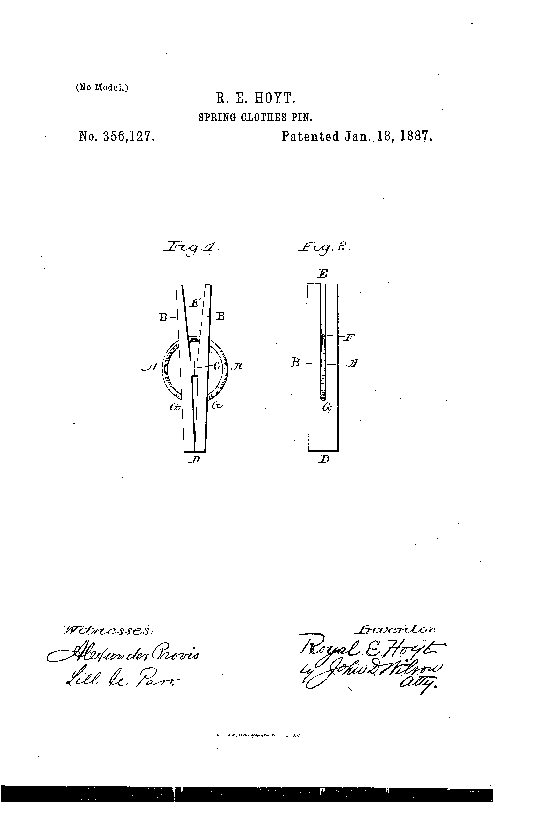

# A1 – [Topic]

## Objective
In this assignment, I must choose 2 past students created portfolio, for class 2156, and analyze their website to further improve my own portfolio as I progress this semester. 
Then, I must choose a product I use often that has a patent then analyze this product based on function, governing model, and include pictures for this product. After analyzing, I then must find alternative solutions to the product's function I have researched. 

## Analyze
The 1st person's portfolio I have analyzed is Max Sommer from Spring 25 class. 

a) Max's portfolio has a thorough guide to find specific assignments and pages through a guided list with specific names and assignment number. The format allowed me to find any piece of work under 60 seconds. 

b) Max's explaining of the product and its purpose is detailed and will inform anyone enough to explain to someone who has not read the portfolio or know about the product, its purpose, function, and parts used to create the product. 

c) Max shows some reasoning for parts on the product he chose, which was a tape measurer. He explains parts such as the locking mechanism, the housing, and the blade and hook used for measuring. His explaining is thorough and gives a detailed reasoning for each part and its purpose towards the final product. 

d) Max uses professional tone throughout most of the assignment but, there are some areas where he could have been more specific such as the description of the tape measurer. He says "Measuring things is important..." Some examples rather than saying "things" would be more professional to show the intent of what "things" could be used to measure the product with. Max's description of the parts used for a tape measurer are detailed and are professional in my eyes. 

The 2nd person's portfolio I have analyzed is Riley Shaffer from Spring 24 class. 

a) Riley's portfolio has a guided link list of just the assignment number. A short description or short topic description would make guiding his assignments and pages convenient for anyone visiting his portfolio. 

b) Riley's explanation and description, of the product he chose, is described with immense detail and gives a perfect mental image of its parts and purpose. The organization of his analysis of the product is compiled in one large paragraph that can be difficult to navigate what is being described unless you read the entire passage thoroughly. Breaking this paragraph up with an intro word or part would make navigating his analysis convenient for readers. 

c) Riley explains reasoning for the parts from the patent as well as a direct alternative that utilizes other ways of achieving the given purpose through different materials or systems. Again, the compiled one large paragraph can be difficult to understand what part or product he is discussing about as he moves from topic to topic very often throughout this paragraph. Riley could have broken up these different parts to help keep readers intrigued and engaged by keeping them on track with what they are reading as they navigate through the assignment. 

d) Riley uses professional descriptions and tones throughout his assignment by utilizing patent numbers and specific part names to differentiate which product he is explaining. With this detailed tone and phrasing, an employer would easily be able to understand and navigate through the assignment if wanting to learn more about the product he chose. 

The final task is choosing a product to analyze. The product I chose is a Spring Clothes-Pin. US Patent number US356127A.

a) The Spring Clothes-Pin is a product used for hanging clothes onto a wire that then will utilize the sun's natural heat to dry the clothes hanging from the Clothes-Pin. The Clothes-Pin uses two arms connected by a spring that when applied force on the two ends of the arms, the arms will open, the clothes are then inserted between the two arms and when the arms are released, they will clamp the clothes and leave them hanging from the wire by the force of the Clothes-Pin. 

b) i) The governing model of the Clothes-Pin utilizes static moment equilibrium. 

When the two arms are pressed on one end of each arms, they are forced to open and make a V shape which is held until the force of whatever is pressing the two ends to touch to open, are released. This causes the two arms to touch on the other end which is where the arms will then clamp clothes and hold the clothes until force is pressed on the opposite ends. 

ii) An assumption that makes this product valid would be treating the wooden arms as rigid bodies. The deformation and bending values are negligible because the spring holding the two arms together is the main force being used and this force is to keep the two arms touching from only one end of the arms together and touching which causes the clamping in this product. 

c) From the previous image used to display the product, "1887 Patent image of a Spring Clothes-Pin," the two arms are labeled as parts B. These arms are made to have a slight angle when pressing the end "D" together that creates the clamping needed. The reason for this angle of the two arms meeting is to ensure that the opposing end, "E," can be pressed to open the clamping end, "D," that will hold clothes. 

Using this same image, there is a spring labeled as "A." This spring is used to hold pressure on the two arms to ensure when there is no pressure applied to the two ends at "E," the opposing end at "D," will stay clamped with enough pressure to hold clothes. When pressure is applied to point "E," the spring allows for the two arms to open at the opposing end "D," to allow for clothes to be placed in the area of clamping. 

d) From google patent, the patent number is US356127A and the author is Royal E, Hoyt with witnesses John D. Wilson and Alexander Provls. 

   i) Two alternatives to a Clothes-Pin, would be a binder clip or a chip bag clip. While the intended purposes of these two products are not specifically meant for hanging clothes, they still have a clamping effect that can be used like a Clothes-Pin for hanging clothes on a line. 

   ii) Back in the 1890s, people were using a different type of Clothes-Pin to hang their clothes. These Clothes-Pin's did not have a spring but were a wooden cylinder that was cut at the end towards the middle of the clip in half. The cut would start large then gradually become smaller creating a pinching like effect with the clothes when shoved into the pin. The engineer, Royal E. Hoyt, invented a product that included a spring to create pressure on two arms instead of a natural pinch. I think the spring was chosen to ensure a tight fit of the clamp that can be easily taken on and off the clothesline and clothes themselves while also not damaging the clothes. I think this spring design is revolutionary as spring clamps are still being used in modern times for all sorts of applications outside of clothes hanging. 

## Decide

## Communicate

