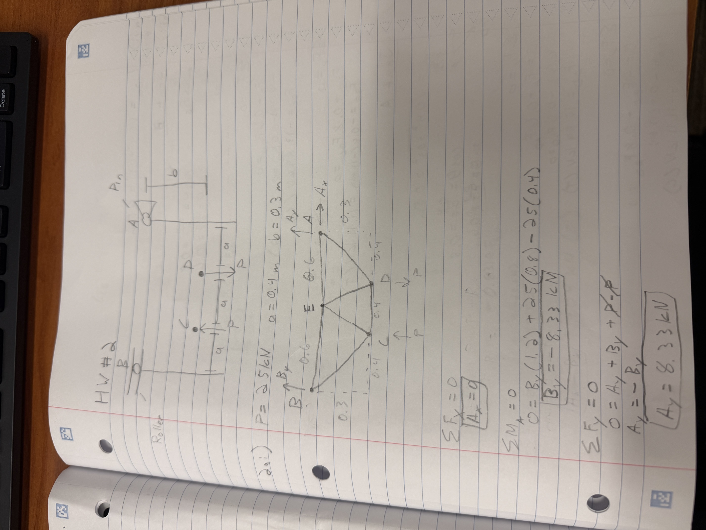
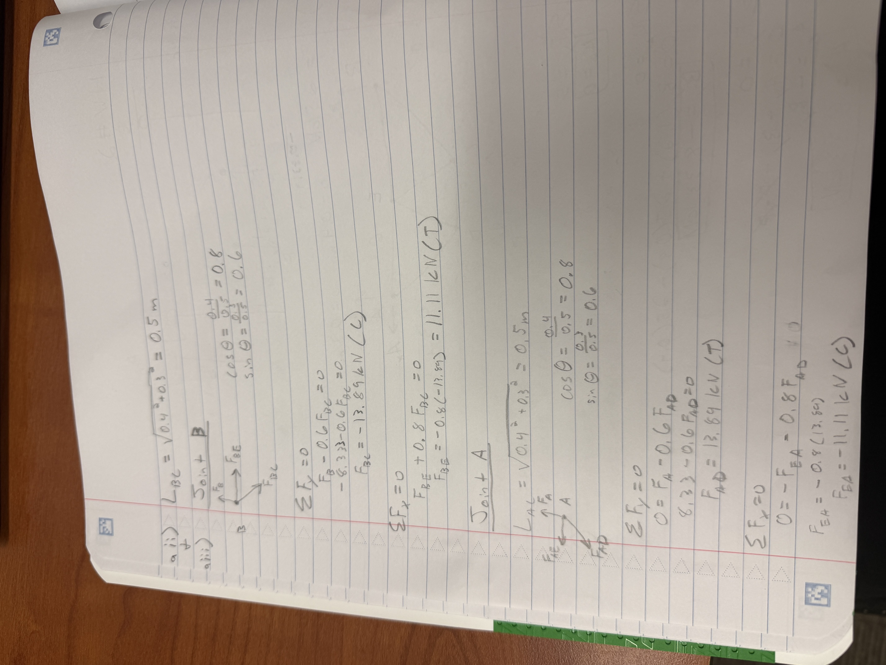
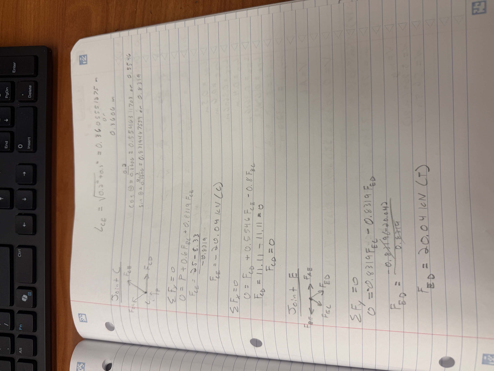
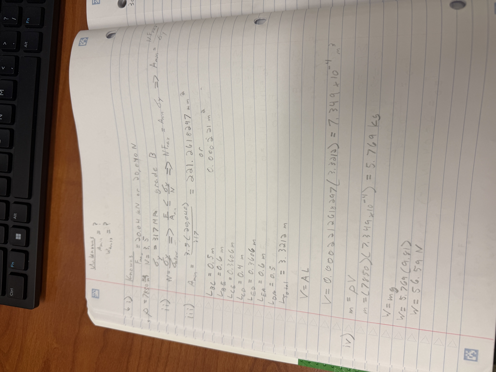
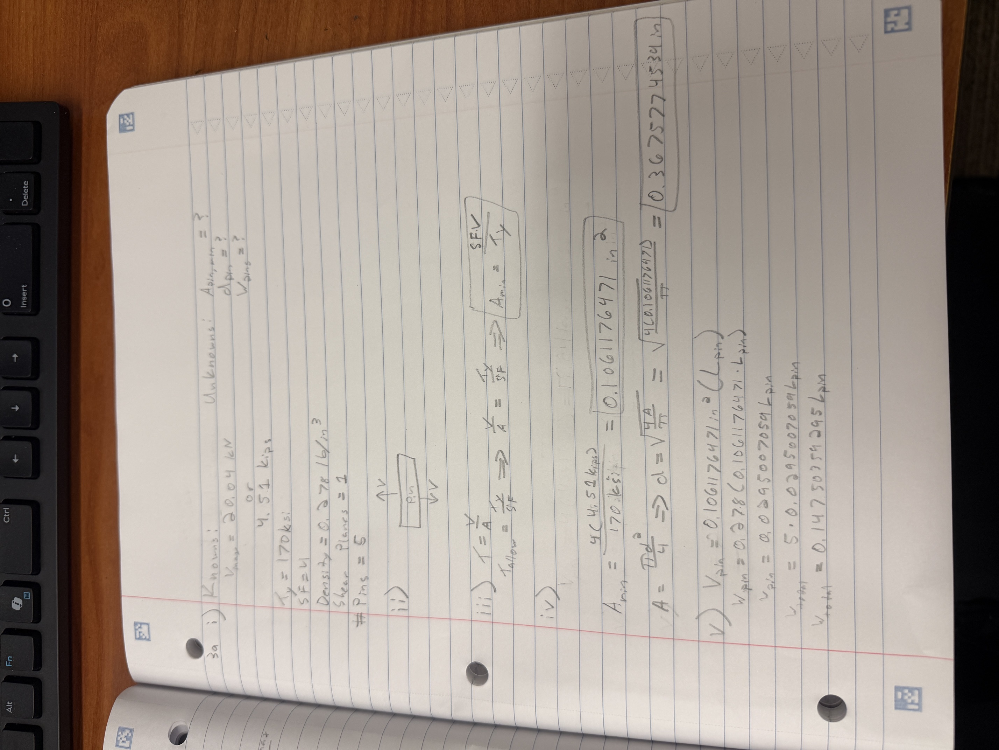

# A2 – Truss Stress Analysis

## Objective
 For this assignment, I was tasked with designing and 3d modeling on a software for a planar truss with A500 structural steel as the material. 

 

The dimensions and load for the given diagram were P=25kN, a=0.4 m, b=0.3 m, Point A is a pin, and Point B is a roller. 

## Decide

I decided to choose a 7-member truss design because of the simplicity of the design for hand calculations with simple geometry and I have seen many trusses designs similar to this design from buildings or large ceiling supports. 

## Analyze

The first step in this assignment was to start with the hand calculations for all the joints using Static's. I started with finding the forces for the support points A and B. Using static equilibrium in both the y and x axis's as well as using the static moment equilibrium, I was able to then find these values were necessary in further calculations for each joint at C, D, and E. Below are the calculations for each joint with free body diagrams, symbolic and numerical equations and their values. 

After finding all of the forces for each joint, I then used the largest internal force to calculate the minimum area needed through my hand calculations that will handle the found materials yield strength of 317 MPa, a safety factor of 3.5, and density of 7850 kg/m^3. 

Lastly, I used equations I learned from Solid Mechanics class to find the cross-sectional area of the 5 pins needed for my 7-member truss design using shear stress equations. The given values for the hardened tool steel for these pins were a yield shear strength of 170 ksi and a density of 0.278 ln/in^3 with a safety factor of 4. I had forgotten the process of finding pin diameters and pin area so, I utilized YouTube as well as my Solid Mechanics notebook to find help videos and examples on the process to solve. 

## SolidWorks Modeling 

For software, I chose to use SolidWorks. A friend of mine recommended SolidWorks as he mentioned it was comprehension able for beginners and the software listed for this assignment were not familiar to me. 

First, I built the truss design, extruded the truss to my calculated dimensions of 15mm by 15mm, then cut holes for the pins at each joint. This step was relatively simple as most software's have very similar building process so my software skills for REVIT were able to translate over to SolidWorks efficiently.   

Next, inputted the pins with their calculated dimensions of 11.11 mm in the precut holes from the first step and extruded the pins so they are extended out of the truss body by 2.5 mm each side. This step again was familiar to me as extruding skills were translated to this software. 

After inputting the pins, I had to edit the material in the software as SolidWorks does not have an "A500" material values. I used values I found online for A500 Structural Steel with a yield strength of 317 MPa and density of 7850 kg/m^3. This step was new to me. I have never used a testing program for load design and calculations before, so I had to learn as I went but in the end, I became familiar with the steps. 

After editing a custom material, I used the same process to create a new Pin Material with the given parameters of density being 0.278 lb/in^3. 

For the next step, I needed to assign supports with designated support types and restrict movement on certain axis's. For Pin A, there is movement in the Y and the X axis. I used the "Support" tab to assign a hinge support for Pin A. Then I used this same process to assign a Roller Support for Pin B which restricts movement in the Y-axis. I had to manually do this as the axis's were not working by choosing specific reference points and selecting which direction was restricted. This process was challenging as the refernce points were very specific and choosing a wrong axis would alter the values heavily. 

Finally, I entered external forces for the locations of P at the joints C and D. At joint C, the load was towards the positive Y-axis while the load at Joint D was towards the negative Y-axis. I had the same issue as assigning supports with the referencing points. Finding the right reference point that would apply the correct load in the correct direction was difficult. I had to choose and change different reference points often for this step and caused many issues. 

Unfortunately, I was not able to get the testing mechanism in the software to correctly work. After attempting close to 5 test runs, my design would constantly bend like a pretzel leading to stress strength in the upwards of thousands of MPa. I think the issue was my calculations for cross sectional area or how I inputted values into my design in the testing phase. I tried to change locations of force applied and could not get the correct values. The calculated pins held up very well with minimal shear stress, but the beams were the main problem with the testing design. 

## Communicate 

After completing this project, I learned that my software skills are subpar. I will need to in the future further expand my skills by watching videos, asking peers for help or tips, and confirm my inputted values are in the correct area needed to test for specific items of interest. Time management was another issue I had with this project. During the week, I had touched on the hand calculations during the week but did not work on the 3d model until the weekend. With this late 3d modeling attempt, I found out my computer struggles to run SolidWorks well, so I had to come Monday to access the Duke Computer Lab to work on the 3d Model. This caused a lot of stress and unnecessary careless errors as I learned the program. Starting the day of an assignment being due, I will plan ahead by looking and starting the following weeks assignment to get an early headstart in case I have any issues down the road. In total, I spent about 13 hours on this assignment.

[Download SolidWorks Model](A02Assignment3dModel.SLDPRT)

