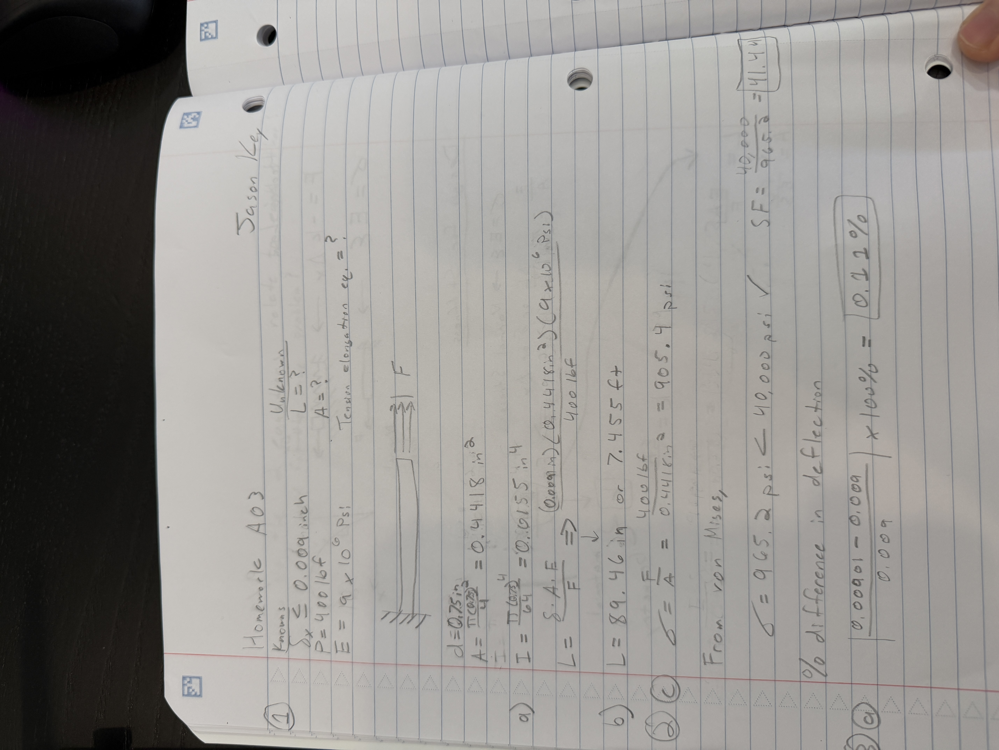

# A3 – [Topic]

## Objective

For assignment A03, the objective of this assignment was to calculate and design a beam design with an aluminum material in CAD modelling. The beam design is meant to be a circular cross section that is fixed on one side with a force applied on the opposite side. First, hand calculations will confirm dimensions that will be inputted into SolidWorks equations lists that will then be used for the FEA test to obtain a safety factor, stress value, and deflection confirmation. The maximum deflection allowed that was given in the assignment was 0.009 inches. 

## Analyze

For the parametric design, a range of values for Applied Load and Young's Modulus were given to choose from to then calculate further information needed for the beam design. For the Applied Load, I chose 400 lbf and for Young's Modulus, I chose a value of 9,000,000 psi. I chose these values because they both were in the middle of the given ranges for this assignment. 

With my hand calculations, I chose a beam design diameter of 0.75 inches. My area came out to be 0.4418 inches squared. Then, using the Bar Tension Elongation equation, the length of my beam design came out to be 89.46 inches. 

## SolidWorks

With SolidWorks rounding my values for length and area to only 2 decimal places, my length stayed at 89.46 inches. This rounding might have affected my values with the FEA test later on. 

 ## FEA Test

For the material of Aluminum, I had to make a custom material with the following parameters.

- Elastic Modulus = 9,000,000 psi
- Poisson's Ratio = 0.33
- Mass Density = 0.0975 lb/in^3
- Yield Strength = 40,000 psi

Next, I set a fixed geometry at one end of the beam with the other end having an applied load of 400 lbf in the opposite horizontal direction. 

After conducting the FEA test and obtaining the displacement test, a displacement test value of 0.00901 inches resulted. I believe from SolidWorks rounding of the values for the area and length have caused this deflection to be slightly over by 0.00001 inches of axial deflection. If the program did not round these values, the deflection value would have been equal to 0.009 inches. 

From the Von Mises stress result, the maximum stress was 965.2 psi. With a given Yield Strength of 40,000 psi, the safety factor with my beam design resulted in 41.44. This safety factor is very high meaning that with the given material and beam design parameters, the stress within the beam will be much smaller than the maximum stress for the material. The beam design is considered very safe for the parameters and given deflection value. 

## Percent Difference

For the beam design and given beam deflection, I had a percentage difference of 0.11%. I believe that the values of area and length in the equations list caused this percentage error. In my hand calculations, the maximum stress for the beam was 905.4 psi. I think the SolidWorks program is very accurate if the values in the equations list were not rounded. In my hand calculations, I was able to go to 8 decimal points which provides a smaller percentage difference when comparing stresses or deflection values. 

## Lessons Learned 

During this assignment, I further improved my skills with SolidWorks as my FEA tests were successful and showed my calculations were correct. I also learned further about how SolidWorks rounds and will research on how to fix this issue for more precise values to obtain more accurate results. This assignment went well as I was well aware of the SolidWorks program to conduct the assignment. In total, this assignment took about 4 hours to complete. 

[Download SolidWorks Project](A03.zip)

