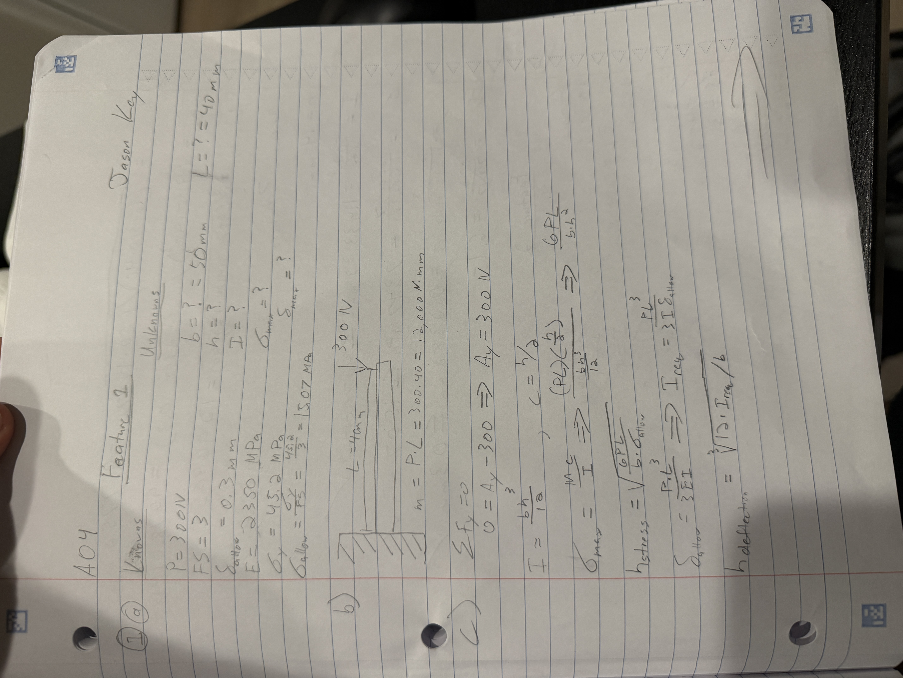
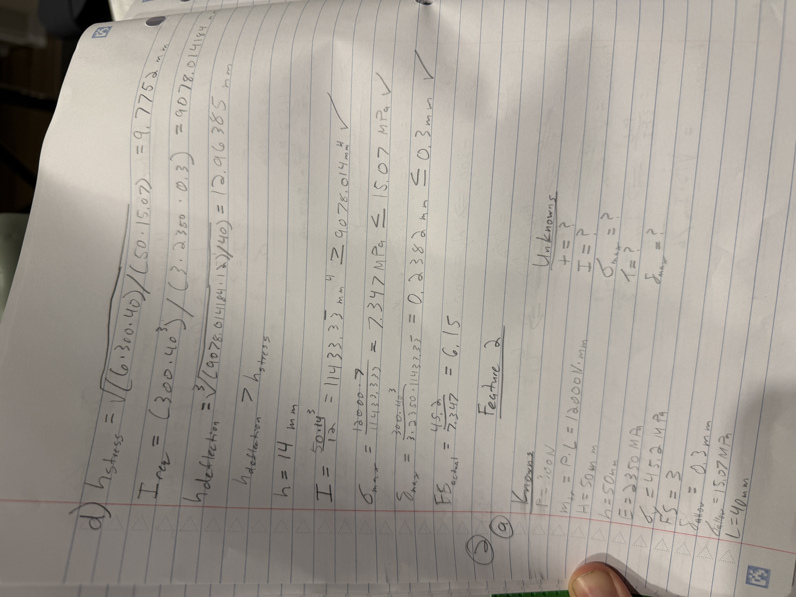
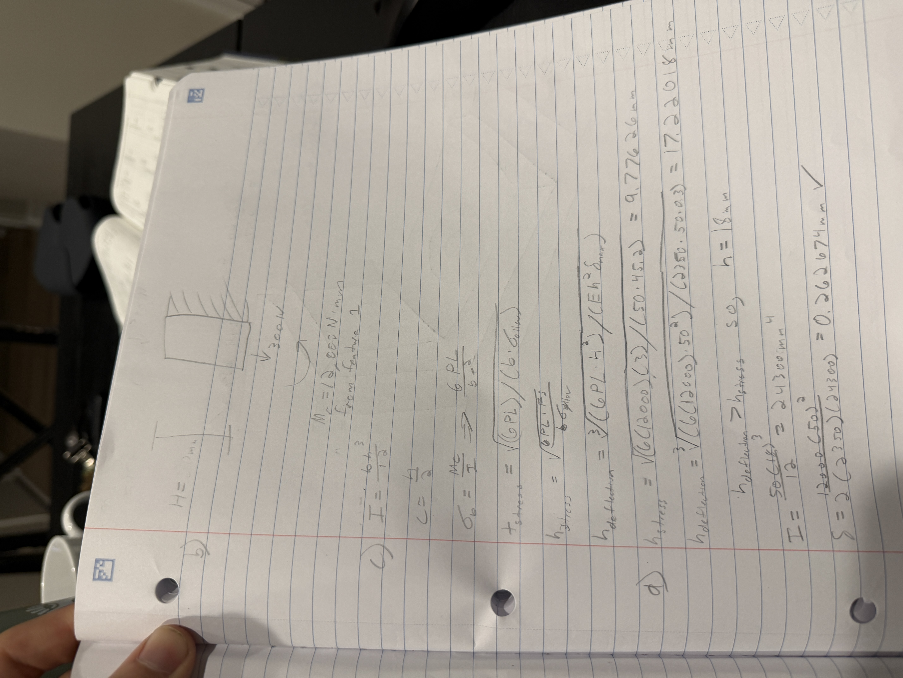

# A4 – [Topic]

## Objective

For assignment 4, the task was to design a mount for a brushed 24 V DC gear motor with a 99.5:1 planetary gearbox, bolted to a rigid wall A. The mount is made of two features: Feature 1 that carriers the motor and then Feature 2 that is bolted to the wall. Both features are built for restraining yield strength as well as a maximum deflection value of 0.30 mm. More given values are described in the next section. 

## Design Requirements

The applied load has a value of 300 N, with a Safety Factor of 3. The motor shaft has a diameter of 6 mm with 4 motor mounting holes of M3 on a 22 mm diameter bolt circle. The motor body has a diameter of 28 mm. The bolt clearance holes have a diameter of 3.4 mm. For this project, I chose to use PLA. PLA has a relatively high elastic modulus that will limit the axial deflection maximum of 0.30 mm. This material will help ensure the safety of these parameters while also giving a strong value for yield strength as well. 

I then researched options of L-Shaped mounts to determine a range of dimensions for my basic geometry. 

-[Misumi Two Double Hole Mount](https://us.misumi-ec.com/vona2/detail/110302706930/?list=PageCategory&seriesCode=110302706930&tab=drawingAndSpecifications&Page=1)
-[Commercial Bracket](https://www.bing.com/shop/productdetails?goid=340547544773&entryPoint=genresultspage&q=commercial+L-bracket+for+motors&FORM=GRPPDP)
-[Tronic L-Bracket Motor Mount](https://tronic.lk/product/l-bracket-steel-motor-mount-25mm-with-hex-coupler)

## Feature 1

For Feature 1, I must use a free body diagram to get the reactions and moment based on the dimensions given as well as some guessed dimensions. I used a width of 50 mm and length of 40 mm. I felt that these two similar values will help bring the deflection to a lower value while still giving solid geometry for a high resilience to bending. I used the axial deflection equation as well as the bending stress equation to then find the thickness of feature 1 required for the given parameters. 

Following finding the symbolic equations, I then plugged in my values and compared values for required thickness to meet the parameter values. With my hand calculations, I found that the thickness from the deflection calculations was higher than the thickness calculations from the stress equations. The thickness for my feature 1 came out to be 14 mm. In my equations, my value came out to be 12.93 mm so, I decided to round up by an extra mm to give an extra safety barrier for my values without being so close to the minimum thickness. 

## Feature 2

For feature 2, I was slightly confused on the free body diagram set up as the screws will mount this feature to the wall, but I eventually figured it out. I used the deflection equation as well as the bending stress equation to obtain the thickness for this feature. After my calculations, the thickness came out to be 18 mm. 

For the second feature, figuring out the dimensions as well as the free body diagram for this feature was an issue for me. I had to watch some YouTube videos to reteach some fundamental ideas from Solid's class. I am still slightly confused and am unsure if my free body diagram is correct. This could change my values tremendously. 

## Sketch

After completing my hand calculations for both Feature's 1 and 2, I then created an isometric sketch based on my dimensions for this motor mount. 

## CAD Model (Parametric) 

Finally, I used all the calculations done by hand, to then translate these values into SolidWorks to create a 3D model of my designed motor mount. First, I inputted all the variables as well as equations into SolidWorks equations list. 

Finally, I used these variables and dimensions entered, to design the motor mount into SolidWorks. I then entered the diameters of all the screw holes as well as the motor's shaft into the corresponding faces of the mount. 

## Lessons Learned

From this assignment, I learned more about the vital parts of a design when figuring out dimensions of a design. When changing or altering values by any slight change, resulting changes can drastically change your design. At first, I had chosen very small dimensions which caused my design to not meet the required deflection and yield strength for the PLA material I had originally chosen. 

Once I had refined the dimensions to meet the given values, the hand calculations went smoothly and was able to obtain dimensions that made sense and gave a strong safety factor. At first, I made the mistake of adding my thickness for the dimensions of my features when drawing the isometric sketch as well as 3D modeling the motor mount in SolidWorks. In the future, I will need to make sure I double check my dimensions in different views and making sure the dimensions are measured in the corrects ways needed to 3D model. 

In total, this assignment took me about 7 hours to complete. 

## CAD File Download

Attached is the compressed Zip file for my SolidWorks file for assignment 4. 

[SolidWorks File](A04.zip)

