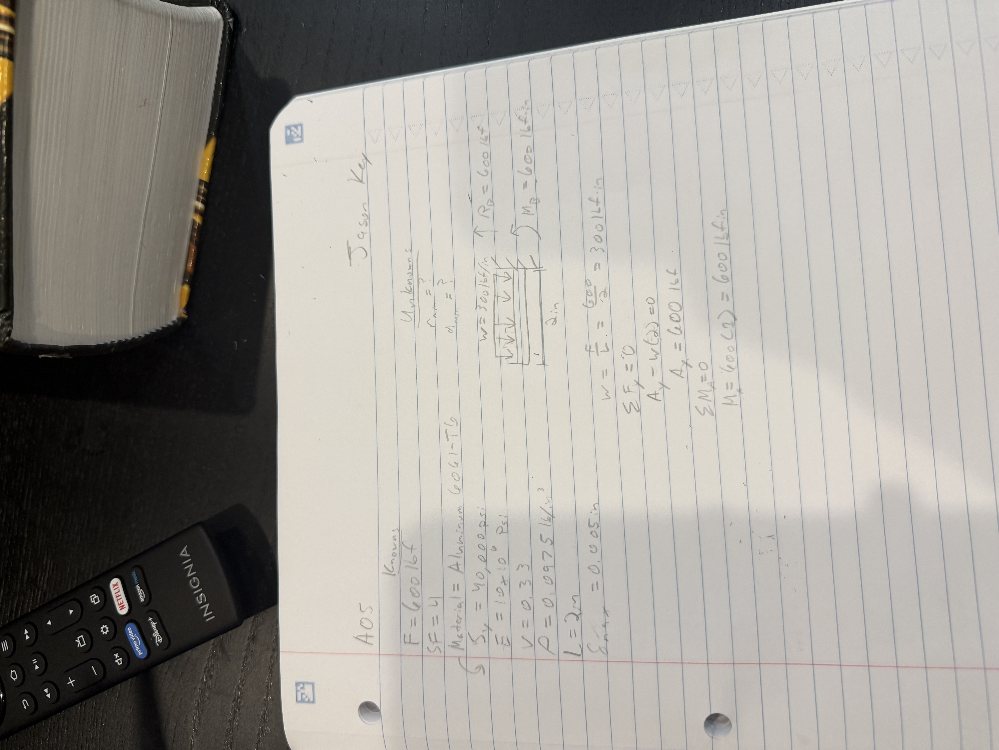

# A5 – [Topic]

## Objective
The objective of this assignment is to design a bracket that will hold a force applied symmetrically in the horizontal axis by a polyester strap. To design this bracket, I have been tasked to conduct two different analysis tests on 5 different features. The two tests are based on Stress and Stiffness. I can choose the values of dimensions that will then reach the given values needed for this bracket design. 

The load applied to the bracket will be 600 lbf, maximum allowable deflection of 0.005 inches and a Safety Factor of 4. For the material, I decided to use Aluminum 6061-T6. This material has a very high strength to weight ratio which will help keep this bracket lightweight yet very durable and strong. This material is also very common to find as well as the ease to machine into specific dimensions with a Lathe, grinder, etc. 

## Analyze

With these given values explained in the objective, I then had to find the Free Body Diagrams, Known and Unknown Values, Algebraic Solution, and Numerical Solution. I used this process for each Feature, A through E, for both the Stress Analysis and Stiffness Analysis. I decided to take an educated guess on the dimensions and as I continued verify values, I made small adjustments to further guarantee the values of Stress within the Aluminum 6061-T6 yield strength of 40,000 Psi. With a safety factor of 4, the Stress Allowed came out to 10,000 Psi. 

## Decide

## Communicate

