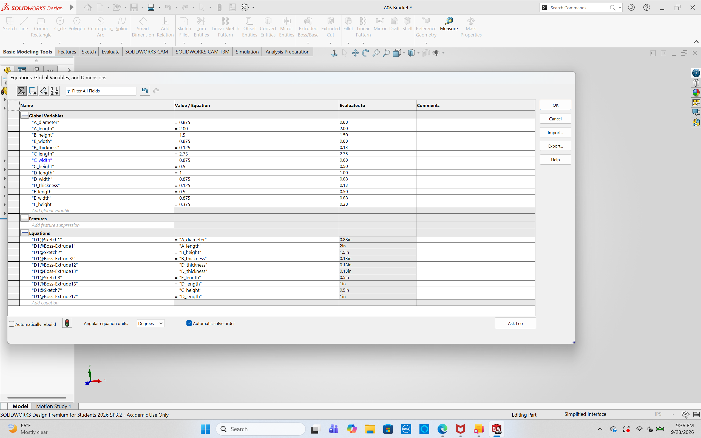
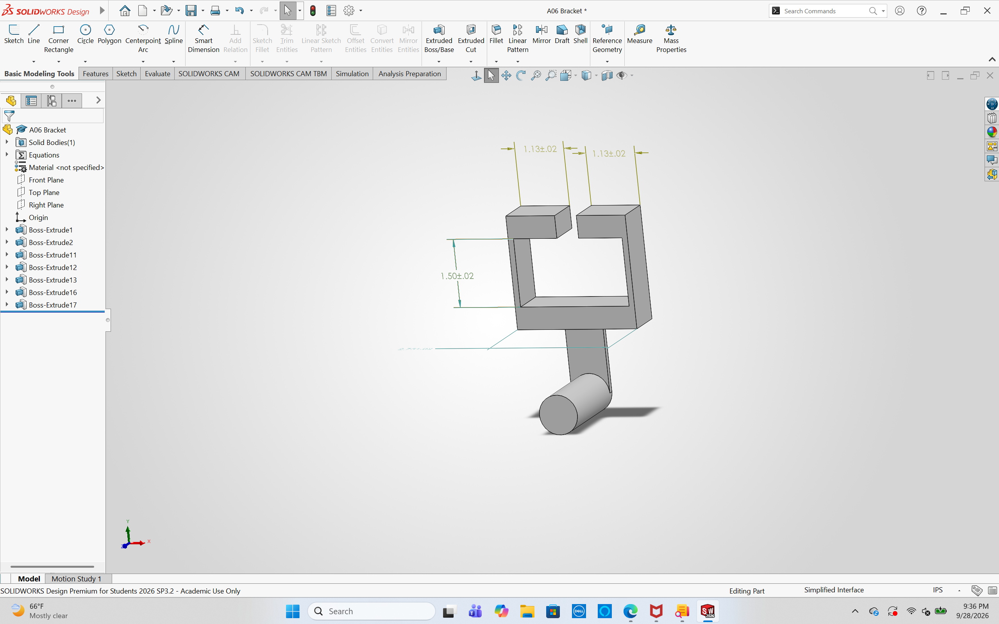
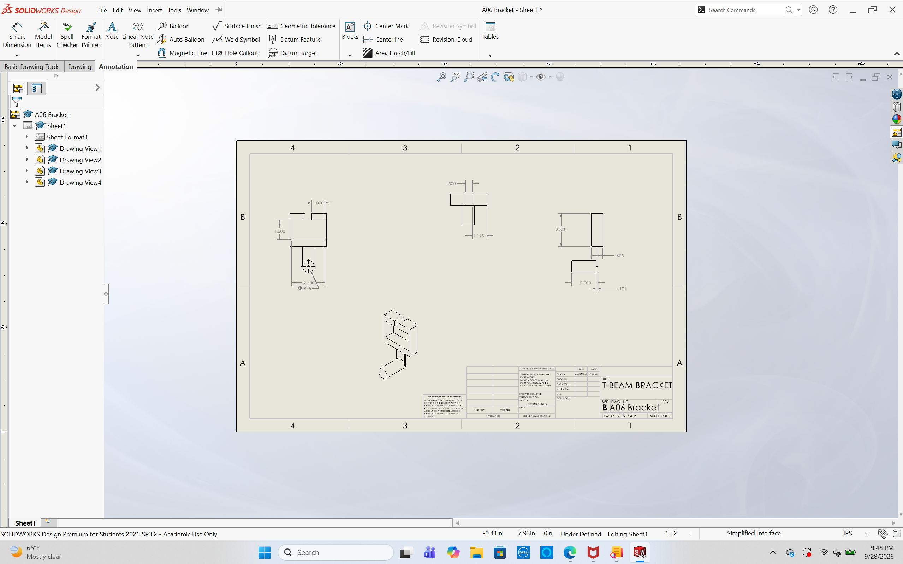

# A6 – [Bracket Drawing]

## Objective
The objective for this assignment is to use the previous assignments dimensions calculated for a T-Fitting Bracket, to create a 3D modeling object then create a drawing. Last week's assignment, I was tasked with finding the dimensions for a T-Fitting Bracket design based on dimensions given of the T-Fitting and a specific load applied on the bracket. Using these dimensions, a 3D model will be created. Then, a drawing will be created using a third angle projection on an ANSI B drawing sheet. 

## Parametric Design

For the 3D modeling of the bracket, I had made the bracket with my calculated dimensions then realized when checking over the assignments given values for the gap and realized my calculations were incorrect due to a misinterpretation of what the bracket should look like. I used the wrong values for the gaps of b and c which lead to my bracket being severely smaller than the needed dimensions for the T-Fitting values. Because of this error, I had to redo my calculations from last week's assignments to get my new dimensions that will fit the gap and hold the load applied. 

First, I entered my dimensions into the equations sheet to then utilize the "Smart Dimensions" tool to get the exact dimensions needed for each feature and part. 

Next, I started building my bracket design in SolidWorks with the "Smart Dimensions" tool and extrude feature. 

## Drawing

After constructing the 3D model for the bracket, I used SolidWorks' drawing feature. After selecting an ANSI B template, I selected the 4 different views for my drawing. I used a front view, right side view, top view, and an isometric view. I then added the specific tolerances provided for two decimal places, three decimal places, and 4 decimal places. Using the Smart Dimensions tool again, I selected the important and necessary dimensions that need to be shown. The specific dimensions that are extremely important were the T-Fitting "gap" dimensions. These dimensions were shown in multiple views to confirm the gap is within the tolerances and will fit the T-Fitting. 

## Reflection

After the calculation error, I had to spend extra time confirming my new dimensions to make sure the gap will fit in my bracket. This caused some headaches as I was not expecting to spend this large amount of time on this assignment. Being an intern at a mechanical engineering firm, I am well versed in creating drawings for designs, more specifically HVAC ductwork planning. The drawing and 3D modeling did not take long as I have practiced 3D modeling and was able to fly through the construction only after I recalculated my bracket design. 

I used the beam deflection equation to determine the required height for Feature C. The required height equated to 0.302 inches so, I selected 0.50 inches to give a cushion in extra material and make the dimensions simple and fractionally similar. SolidWorks was giving me errors that did not make sense to me, so I believe I entered equations incorrectly into the table leading to me having to just input the calculated values.  

I applied a higher tolerance to the width of the T-Fitting gap. This higher tolerance will help give the bracket and fitting extra room to have a fitting that will work while not being too loose that will cause issues with holding the T-Fitting. From the tolerances of "a" and "b", the calculated width needed to be 2.4964 inches. In the tolerances, the gap width was only able to go under these values but, I gave the width of my bracket to be 2.50 inches to give that small extra gap to ensure ease of fit but still being able to hold the fitting. I do not believe this measurement gap will cause major issues with the design in the long run.

In total, I spent about 6 hours on this assignment. 

Below, is the link to download my SolidWorks' 3D model file. 
[Download my SolidWorks Bracket File](A06%20Bracket.zip)

Below, is the link to access my SolidWorks' drawing. 
[Download my SolidWorks Drawing File](A06BracketDrawing.SLDDRW)
